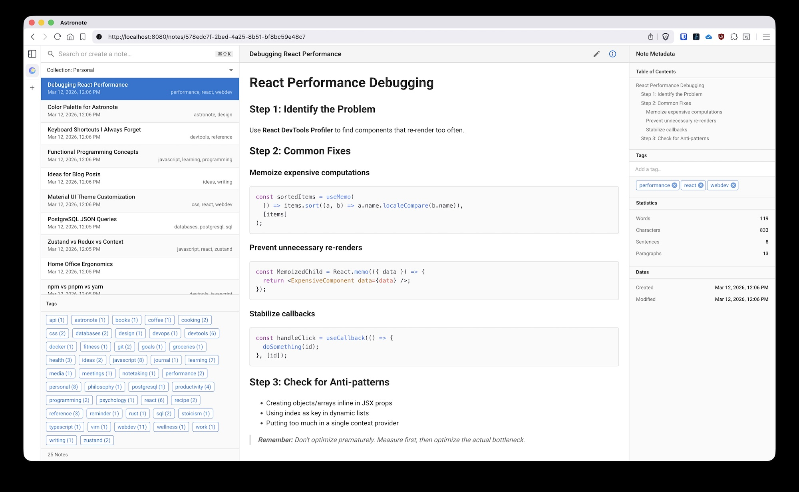

# Astronote

Yet another note taking application[^1].



## Quick Start

```
docker run -p 8080:3009 tkambler/astronote:latest
```

If you want to build the Docker image yourself, just run: `make`

## Running in Development Mode

```sh
# This will install dependencies and launch the API and frontend application in development mode.
yarn
yarn dev
```

## Packages

This project is structured as a [monorepo](https://monorepo.tools/) managed with [Turborepo](https://turborepo.dev/). It contains several packages:

### Applications

- [apps/web-app](apps/web-app) - React-based UI.
- [apps/api](apps/api) - REST API. This layer is intentionally minimal. It validates requests and forwards them to the `domain` package (see below).
- [apps/desktop](apps/desktop) - A standalone, [Electron](https://www.electronjs.org/)-based variant that runs on the desktop (no REST API is required).

### Libraries

- [packages/astronote-client](packages/astronote-client) - Exports an API for use by the web app or the desktop app. The web variant routes requests to the REST API. The desktop variant routes requests directly to a local package (`packages/domain`).
- [packjages/domain](packages/domain) - Business logic lives here.
- [packages/repository](packages/repository) - Database code lives here.
- [packages/types](packages/types) - Exports shared [Zod](https://zod.dev/) validation functions and inferred TypeScript types.
- [packages/eslint-config](packages/eslint-config) - Shared [ESLint](https://eslint.org/) config.
- [packages/typescript-config](packages/typescript-config/) - Shared [TypeScript](https://www.typescriptlang.org/) config.

[^1]: This one's the best, though.